# 공연 이후 관객 리액션 및 설문 결과 분석

생성일: 2026-05-28

## 데이터 개요

- 설문 응답: 5명
- 리액션 이벤트: 100건
- 리액션 참여 클라이언트: 6명
- 리액션 곡 수: 11곡
- 설문-리액션 매칭 응답자: 4명
- 설문만 있고 리액션 로그가 없는 응답자: 1명
- 리액션만 있고 설문이 없는 클라이언트: 2명

## ID 연결 분석

설문과 공연 중 웹 인터렉션은 같은 client_id를 사용하므로, 익명 응답자 단위로 실제 행동량과 사후 평가를 연결해 볼 수 있습니다. 단, 설문 응답자가 5명으로 적기 때문에 상관계수는 결론이라기보다 탐색적 단서로 해석해야 합니다.

### 응답자별 행동-설문 요약

| 응답자 | 리액션 로그 | 총 리액션 | 리액션한 곡 수 | 1곡당 리액션 | 최다 리액션 곡 | 주 리액션 | 전체 설문 평균 | 전반 만족 | 능동 참여 | 재관람 | 상호작용 평균 | 인상 요소 수 |
| --- | --- | --- | --- | --- | --- | --- | --- | --- | --- | --- | --- | --- |
| 응답자 1 | yes | 10 | 6 | 1.67 | Knock Knock | 반짝임 | 3.71 | 4 | 3 | 4 | 4.33 | 3 |
| 응답자 2 | no | 0 | 0 | 0 |  |  | 3.14 | 3 | 4 | 3 | 3.11 | 1 |
| 응답자 3 | yes | 7 | 4 | 1.75 | 날 좀 봐줘요, 좀 봐줘요 | 박수 | 4.43 | 4 | 5 | 4 | 4.56 | 2 |
| 응답자 4 | yes | 65 | 11 | 5.91 | 부둣가 | 좋아요 | 5 | 5 | 5 | 5 | 5 | 3 |
| 응답자 5 | yes | 3 | 2 | 1.5 | 새벽두시 | 좋아요 | 4.29 | 4 | 5 | 5 | 4.67 | 5 |

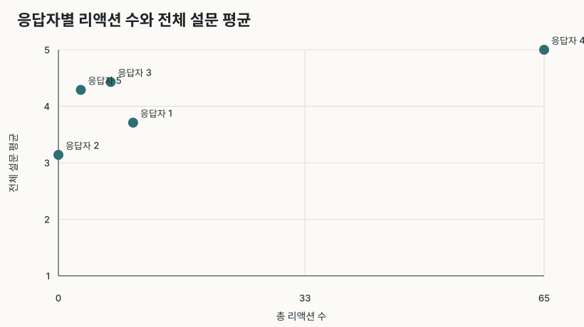

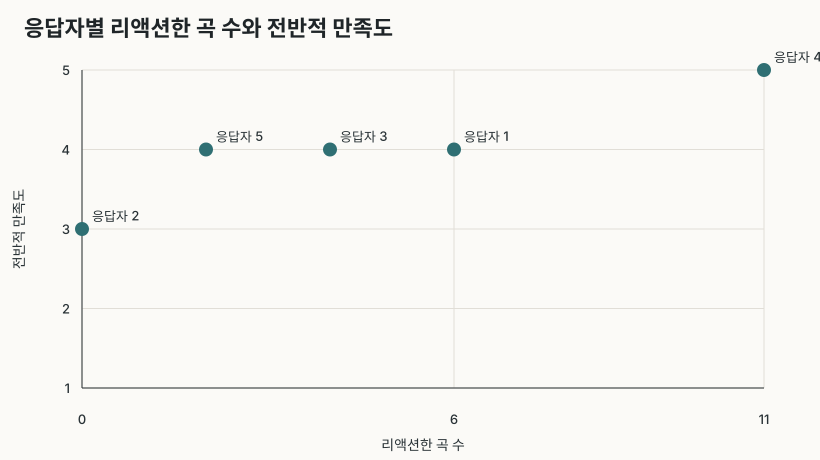

### 탐색적 상관

| 행동 지표 | 설문 지표 | N | Pearson r | 비고 |
| --- | --- | --- | --- | --- |
| 리액션한 곡 수 | 전반적 만족도 | 5 | 0.922 | 표본이 작아 탐색적 지표로만 해석 |
| 총 리액션 수 | 전반적 만족도 | 5 | 0.848 | 표본이 작아 탐색적 지표로만 해석 |
| 리액션한 곡 수 | 전체 설문 평균 | 5 | 0.744 | 표본이 작아 탐색적 지표로만 해석 |
| 총 리액션 수 | 전체 설문 평균 | 5 | 0.729 | 표본이 작아 탐색적 지표로만 해석 |
| 리액션한 곡 수 | 상호작용 평가 평균 | 5 | 0.725 | 표본이 작아 탐색적 지표로만 해석 |
| 리액션한 곡 수 | 재관람 의향 | 5 | 0.595 | 표본이 작아 탐색적 지표로만 해석 |
| 총 리액션 수 | 상호작용 평가 평균 | 5 | 0.583 | 표본이 작아 탐색적 지표로만 해석 |
| 총 리액션 수 | 흐름/몰입도 | 5 | 0.572 | 표본이 작아 탐색적 지표로만 해석 |

### 설문 없이 리액션만 있는 클라이언트

| 참여자 | 총 리액션 | 리액션한 곡 수 | 최다 리액션 곡 | 최다 곡 리액션 수 | 주 리액션 | 주 리액션 수 |
| --- | --- | --- | --- | --- | --- | --- |
| 리액션만 1 | 8 | 3 | Knock Knock | 4 | 박수 | 4 |
| 리액션만 2 | 7 | 6 | 스물여덟 | 2 | 반짝임 | 3 |

## 질문 및 답변 형식

| 문항 | 질문 | Question | 답변 방식 | 답변 선택지 |
| --- | --- | --- | --- | --- |
| 전반적 만족도 | 오늘 공연에 전반적으로 만족했다. | Overall, I was satisfied with today’s performance. | 5점 리커트 척도 단일 선택 | 1=전혀 그렇지 않다(Strongly disagree), 2=그렇지 않다(Disagree), 3=보통이다(Neutral), 4=그렇다(Agree), 5=매우 그렇다(Strongly agree) |
| 흐름/몰입도 | 공연의 흐름이 자연스럽고 몰입하기 좋았다. | The flow of the performance felt natural and immersive. | 5점 리커트 척도 단일 선택 | 1=전혀 그렇지 않다(Strongly disagree), 2=그렇지 않다(Disagree), 3=보통이다(Neutral), 4=그렇다(Agree), 5=매우 그렇다(Strongly agree) |
| 공간 적합도 | 공연 공간의 분위기가 곡과 잘 어울렸다. | The atmosphere of the venue matched the songs well. | 5점 리커트 척도 단일 선택 | 1=전혀 그렇지 않다(Strongly disagree), 2=그렇지 않다(Disagree), 3=보통이다(Neutral), 4=그렇다(Agree), 5=매우 그렇다(Strongly agree) |
| 바닥 착석 편안함 | 돗자리에 앉아 인터렉션에 참여하는 공연장의 공간 구도가 편안했다. | The floor-seating layout for participating in the interactions felt comfortable. | 5점 리커트 척도 단일 선택 | 1=전혀 그렇지 않다(Strongly disagree), 2=그렇지 않다(Disagree), 3=보통이다(Neutral), 4=그렇다(Agree), 5=매우 그렇다(Strongly agree) |
| 능동적 참여도 | 기존의 일반적인 공연보다 더 능동적으로 참여한다고 느꼈다. | Compared with a typical concert, I felt more actively involved. | 5점 리커트 척도 단일 선택 | 1=전혀 그렇지 않다(Strongly disagree), 2=그렇지 않다(Disagree), 3=보통이다(Neutral), 4=그렇다(Agree), 5=매우 그렇다(Strongly agree) |
| 예술적 적합도 | 인터렉션 요소가 공연의 예술적 완성도를 해치지 않고 자연스럽게 어울렸다. | The interactive elements felt natural and did not weaken the artistic quality. | 5점 리커트 척도 단일 선택 | 1=전혀 그렇지 않다(Strongly disagree), 2=그렇지 않다(Disagree), 3=보통이다(Neutral), 4=그렇다(Agree), 5=매우 그렇다(Strongly agree) |
| 재관람 의향 | 다시 비슷한 형식의 공연을 관람하고 싶다. | I would like to attend a similar performance again. | 5점 리커트 척도 단일 선택 | 1=전혀 그렇지 않다(Strongly disagree), 2=그렇지 않다(Disagree), 3=보통이다(Neutral), 4=그렇다(Agree), 5=매우 그렇다(Strongly agree) |
| 분위기 이해 - 빔프로젝터 | 곡의 감정이나 분위기를 이해하는 데 도움이 되었다. - 빔프로젝터 | It helped me understand the emotion or mood of the songs. - Projection | 영역별 5점 리커트 척도 단일 선택 | 1=전혀 그렇지 않다(Strongly disagree), 2=그렇지 않다(Disagree), 3=보통이다(Neutral), 4=그렇다(Agree), 5=매우 그렇다(Strongly agree) |
| 분위기 이해 - 웹 페이지 | 곡의 감정이나 분위기를 이해하는 데 도움이 되었다. - 웹 페이지 | It helped me understand the emotion or mood of the songs. - Web page | 영역별 5점 리커트 척도 단일 선택 | 1=전혀 그렇지 않다(Strongly disagree), 2=그렇지 않다(Disagree), 3=보통이다(Neutral), 4=그렇다(Agree), 5=매우 그렇다(Strongly agree) |
| 분위기 이해 - 실물 터치 | 곡의 감정이나 분위기를 이해하는 데 도움이 되었다. - 실물 터치 | It helped me understand the emotion or mood of the songs. - Physical touch | 영역별 5점 리커트 척도 단일 선택 | 1=전혀 그렇지 않다(Strongly disagree), 2=그렇지 않다(Disagree), 3=보통이다(Neutral), 4=그렇다(Agree), 5=매우 그렇다(Strongly agree) |
| 참여 몰입 - 빔프로젝터 | 공연에 참여하고 몰입하고 있다는 느낌을 주었다. - 빔프로젝터 | It made me feel involved and immersed in the performance. - Projection | 영역별 5점 리커트 척도 단일 선택 | 1=전혀 그렇지 않다(Strongly disagree), 2=그렇지 않다(Disagree), 3=보통이다(Neutral), 4=그렇다(Agree), 5=매우 그렇다(Strongly agree) |
| 참여 몰입 - 웹 페이지 | 공연에 참여하고 몰입하고 있다는 느낌을 주었다. - 웹 페이지 | It made me feel involved and immersed in the performance. - Web page | 영역별 5점 리커트 척도 단일 선택 | 1=전혀 그렇지 않다(Strongly disagree), 2=그렇지 않다(Disagree), 3=보통이다(Neutral), 4=그렇다(Agree), 5=매우 그렇다(Strongly agree) |
| 참여 몰입 - 실물 터치 | 공연에 참여하고 몰입하고 있다는 느낌을 주었다. - 실물 터치 | It made me feel involved and immersed in the performance. - Physical touch | 영역별 5점 리커트 척도 단일 선택 | 1=전혀 그렇지 않다(Strongly disagree), 2=그렇지 않다(Disagree), 3=보통이다(Neutral), 4=그렇다(Agree), 5=매우 그렇다(Strongly agree) |
| 상호작용 편안함 - 빔프로젝터 | 참여 방식이 직관적이고 부담스럽지 않았다. - 빔프로젝터 | The way of participating felt intuitive and comfortable. - Projection | 영역별 5점 리커트 척도 단일 선택 | 1=전혀 그렇지 않다(Strongly disagree), 2=그렇지 않다(Disagree), 3=보통이다(Neutral), 4=그렇다(Agree), 5=매우 그렇다(Strongly agree) |
| 상호작용 편안함 - 웹 페이지 | 참여 방식이 직관적이고 부담스럽지 않았다. - 웹 페이지 | The way of participating felt intuitive and comfortable. - Web page | 영역별 5점 리커트 척도 단일 선택 | 1=전혀 그렇지 않다(Strongly disagree), 2=그렇지 않다(Disagree), 3=보통이다(Neutral), 4=그렇다(Agree), 5=매우 그렇다(Strongly agree) |
| 상호작용 편안함 - 실물 터치 | 참여 방식이 직관적이고 부담스럽지 않았다. - 실물 터치 | The way of participating felt intuitive and comfortable. - Physical touch | 영역별 5점 리커트 척도 단일 선택 | 1=전혀 그렇지 않다(Strongly disagree), 2=그렇지 않다(Disagree), 3=보통이다(Neutral), 4=그렇다(Agree), 5=매우 그렇다(Strongly agree) |
| 인상 깊었던 요소 | 이번 공연에서 가장 인상 깊었던 요소는 무엇인가요? 복수 선택이 가능합니다. | What were the most memorable elements of this performance? You may select multiple options. | 복수 선택형 체크박스 | 음악(Music), 공간 연출(Spatial direction), 천장 프로젝션(Ceiling projection), 웹 이모지 반응(Web emoji reactions), 천둥 버튼(Thunder button), 손 모양 마네킹 인터렉션(Hand mannequin interaction), 관객들과 함께 참여하는 분위기(The shared audience atmosphere) |
| 기억에 남는 순간 | 가장 기억에 남은 순간이나 인터렉션을 적어주세요. | Please write the moment or interaction you remember most. | 자유 서술형 | 응답자가 직접 작성 |
| 개선점 | 개선되었으면 하는 점이 있다면 적어주세요. | Please share anything you think could be improved. | 자유 서술형 | 응답자가 직접 작성 |

## 설문 응답 요약

각 척도형 문항은 점수 분포를 파이차트로 표시했습니다. 서술형 문항은 수치화 요약 뒤에 원문 응답을 그대로 표시했습니다.

가장 높은 평균은 공간 적합도(5)이고, 가장 낮은 평균은 바닥 착석 편안함(3.4)입니다.

### 전반적 만족도

질문: 오늘 공연에 전반적으로 만족했다.  
Question: Overall, I was satisfied with today’s performance.  
답변 방식: 5점 리커트 척도 단일 선택  
답변 선택지: 1=전혀 그렇지 않다(Strongly disagree), 2=그렇지 않다(Disagree), 3=보통이다(Neutral), 4=그렇다(Agree), 5=매우 그렇다(Strongly agree)  
응답 분포: 1점 0명, 2점 0명, 3점 1명, 4점 3명, 5점 1명

응답 5명, 평균 4, 중앙값 4, 4-5점 80%

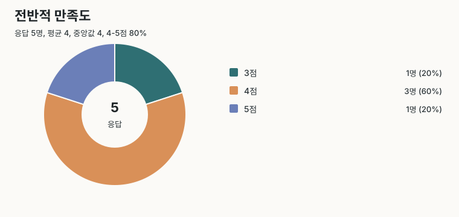

### 흐름/몰입도

질문: 공연의 흐름이 자연스럽고 몰입하기 좋았다.  
Question: The flow of the performance felt natural and immersive.  
답변 방식: 5점 리커트 척도 단일 선택  
답변 선택지: 1=전혀 그렇지 않다(Strongly disagree), 2=그렇지 않다(Disagree), 3=보통이다(Neutral), 4=그렇다(Agree), 5=매우 그렇다(Strongly agree)  
응답 분포: 1점 0명, 2점 0명, 3점 2명, 4점 1명, 5점 2명

응답 5명, 평균 4, 중앙값 4, 4-5점 60%

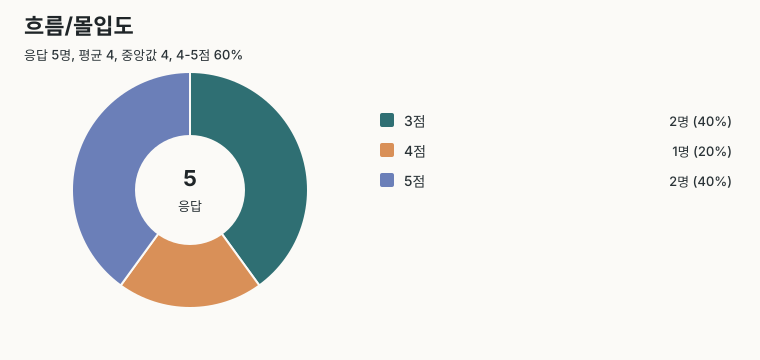

### 공간 적합도

질문: 공연 공간의 분위기가 곡과 잘 어울렸다.  
Question: The atmosphere of the venue matched the songs well.  
답변 방식: 5점 리커트 척도 단일 선택  
답변 선택지: 1=전혀 그렇지 않다(Strongly disagree), 2=그렇지 않다(Disagree), 3=보통이다(Neutral), 4=그렇다(Agree), 5=매우 그렇다(Strongly agree)  
응답 분포: 1점 0명, 2점 0명, 3점 0명, 4점 0명, 5점 5명

응답 5명, 평균 5, 중앙값 5, 4-5점 100%

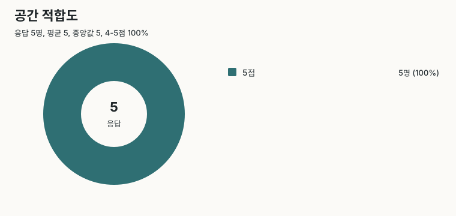

### 바닥 착석 편안함

질문: 돗자리에 앉아 인터렉션에 참여하는 공연장의 공간 구도가 편안했다.  
Question: The floor-seating layout for participating in the interactions felt comfortable.  
답변 방식: 5점 리커트 척도 단일 선택  
답변 선택지: 1=전혀 그렇지 않다(Strongly disagree), 2=그렇지 않다(Disagree), 3=보통이다(Neutral), 4=그렇다(Agree), 5=매우 그렇다(Strongly agree)  
응답 분포: 1점 0명, 2점 1명, 3점 2명, 4점 1명, 5점 1명

응답 5명, 평균 3.4, 중앙값 3, 4-5점 40%

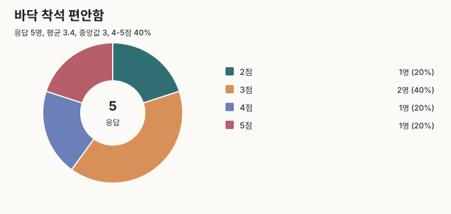

### 능동적 참여도

질문: 기존의 일반적인 공연보다 더 능동적으로 참여한다고 느꼈다.  
Question: Compared with a typical concert, I felt more actively involved.  
답변 방식: 5점 리커트 척도 단일 선택  
답변 선택지: 1=전혀 그렇지 않다(Strongly disagree), 2=그렇지 않다(Disagree), 3=보통이다(Neutral), 4=그렇다(Agree), 5=매우 그렇다(Strongly agree)  
응답 분포: 1점 0명, 2점 0명, 3점 1명, 4점 1명, 5점 3명

응답 5명, 평균 4.4, 중앙값 5, 4-5점 80%

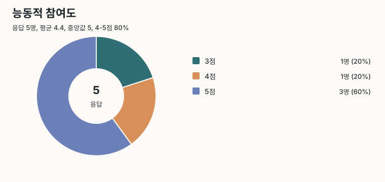

### 예술적 적합도

질문: 인터렉션 요소가 공연의 예술적 완성도를 해치지 않고 자연스럽게 어울렸다.  
Question: The interactive elements felt natural and did not weaken the artistic quality.  
답변 방식: 5점 리커트 척도 단일 선택  
답변 선택지: 1=전혀 그렇지 않다(Strongly disagree), 2=그렇지 않다(Disagree), 3=보통이다(Neutral), 4=그렇다(Agree), 5=매우 그렇다(Strongly agree)  
응답 분포: 1점 0명, 2점 1명, 3점 1명, 4점 1명, 5점 2명

응답 5명, 평균 3.8, 중앙값 4, 4-5점 60%

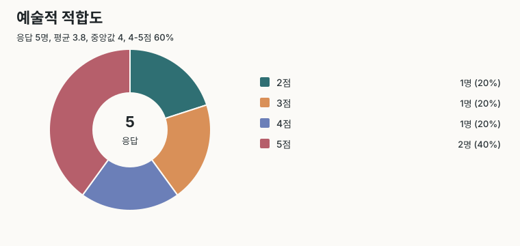

### 재관람 의향

질문: 다시 비슷한 형식의 공연을 관람하고 싶다.  
Question: I would like to attend a similar performance again.  
답변 방식: 5점 리커트 척도 단일 선택  
답변 선택지: 1=전혀 그렇지 않다(Strongly disagree), 2=그렇지 않다(Disagree), 3=보통이다(Neutral), 4=그렇다(Agree), 5=매우 그렇다(Strongly agree)  
응답 분포: 1점 0명, 2점 0명, 3점 1명, 4점 2명, 5점 2명

응답 5명, 평균 4.2, 중앙값 4, 4-5점 80%

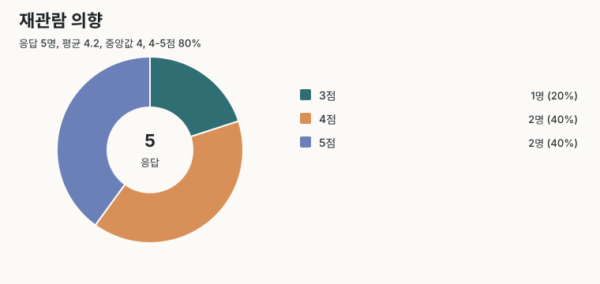

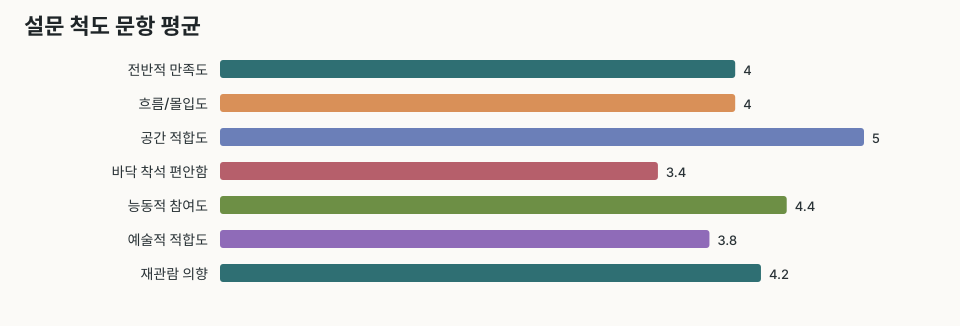

## 상호작용 평가

상위 질문: 인터렉션 경험을 영역별로 평가해 주세요.  
Parent question: Please rate each type of interaction separately.

### 분위기 이해 - 빔프로젝터

질문: 곡의 감정이나 분위기를 이해하는 데 도움이 되었다. - 빔프로젝터  
Question: It helped me understand the emotion or mood of the songs. - Projection  
답변 방식: 영역별 5점 리커트 척도 단일 선택  
답변 선택지: 1=전혀 그렇지 않다(Strongly disagree), 2=그렇지 않다(Disagree), 3=보통이다(Neutral), 4=그렇다(Agree), 5=매우 그렇다(Strongly agree)  
응답 분포: 1점 0명, 2점 0명, 3점 0명, 4점 2명, 5점 3명

응답 5명, 평균 4.6, 중앙값 5, 4-5점 100%

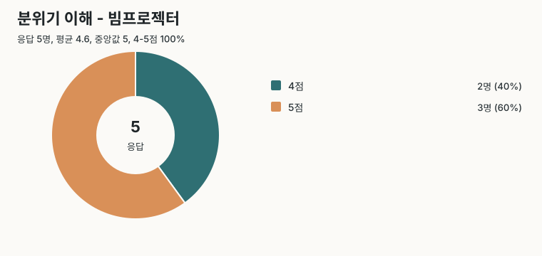

### 분위기 이해 - 웹 페이지

질문: 곡의 감정이나 분위기를 이해하는 데 도움이 되었다. - 웹 페이지  
Question: It helped me understand the emotion or mood of the songs. - Web page  
답변 방식: 영역별 5점 리커트 척도 단일 선택  
답변 선택지: 1=전혀 그렇지 않다(Strongly disagree), 2=그렇지 않다(Disagree), 3=보통이다(Neutral), 4=그렇다(Agree), 5=매우 그렇다(Strongly agree)  
응답 분포: 1점 0명, 2점 0명, 3점 0명, 4점 1명, 5점 4명

응답 5명, 평균 4.8, 중앙값 5, 4-5점 100%

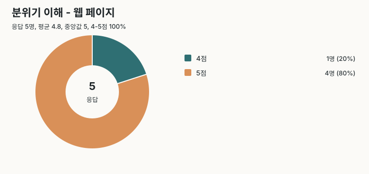

### 분위기 이해 - 실물 터치

질문: 곡의 감정이나 분위기를 이해하는 데 도움이 되었다. - 실물 터치  
Question: It helped me understand the emotion or mood of the songs. - Physical touch  
답변 방식: 영역별 5점 리커트 척도 단일 선택  
답변 선택지: 1=전혀 그렇지 않다(Strongly disagree), 2=그렇지 않다(Disagree), 3=보통이다(Neutral), 4=그렇다(Agree), 5=매우 그렇다(Strongly agree)  
응답 분포: 1점 0명, 2점 1명, 3점 0명, 4점 2명, 5점 2명

응답 5명, 평균 4, 중앙값 4, 4-5점 80%

### 참여 몰입 - 빔프로젝터

질문: 공연에 참여하고 몰입하고 있다는 느낌을 주었다. - 빔프로젝터  
Question: It made me feel involved and immersed in the performance. - Projection  
답변 방식: 영역별 5점 리커트 척도 단일 선택  
답변 선택지: 1=전혀 그렇지 않다(Strongly disagree), 2=그렇지 않다(Disagree), 3=보통이다(Neutral), 4=그렇다(Agree), 5=매우 그렇다(Strongly agree)  
응답 분포: 1점 0명, 2점 0명, 3점 2명, 4점 1명, 5점 2명

응답 5명, 평균 4, 중앙값 4, 4-5점 60%

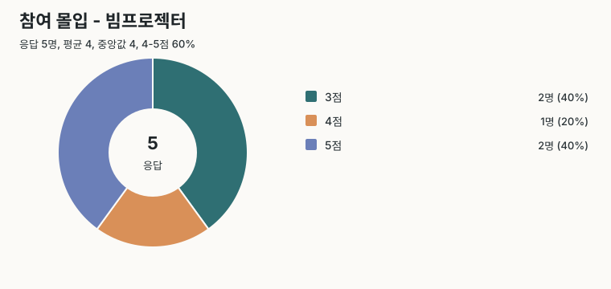

### 참여 몰입 - 웹 페이지

질문: 공연에 참여하고 몰입하고 있다는 느낌을 주었다. - 웹 페이지  
Question: It made me feel involved and immersed in the performance. - Web page  
답변 방식: 영역별 5점 리커트 척도 단일 선택  
답변 선택지: 1=전혀 그렇지 않다(Strongly disagree), 2=그렇지 않다(Disagree), 3=보통이다(Neutral), 4=그렇다(Agree), 5=매우 그렇다(Strongly agree)  
응답 분포: 1점 0명, 2점 1명, 3점 1명, 4점 1명, 5점 2명

응답 5명, 평균 3.8, 중앙값 4, 4-5점 60%

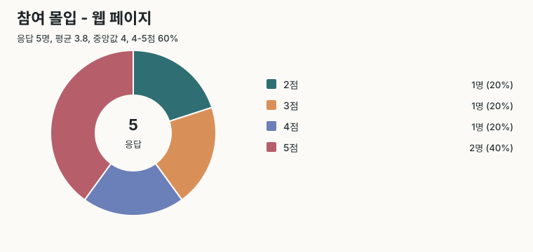

### 참여 몰입 - 실물 터치

질문: 공연에 참여하고 몰입하고 있다는 느낌을 주었다. - 실물 터치  
Question: It made me feel involved and immersed in the performance. - Physical touch  
답변 방식: 영역별 5점 리커트 척도 단일 선택  
답변 선택지: 1=전혀 그렇지 않다(Strongly disagree), 2=그렇지 않다(Disagree), 3=보통이다(Neutral), 4=그렇다(Agree), 5=매우 그렇다(Strongly agree)  
응답 분포: 1점 0명, 2점 0명, 3점 1명, 4점 1명, 5점 3명

응답 5명, 평균 4.4, 중앙값 5, 4-5점 80%

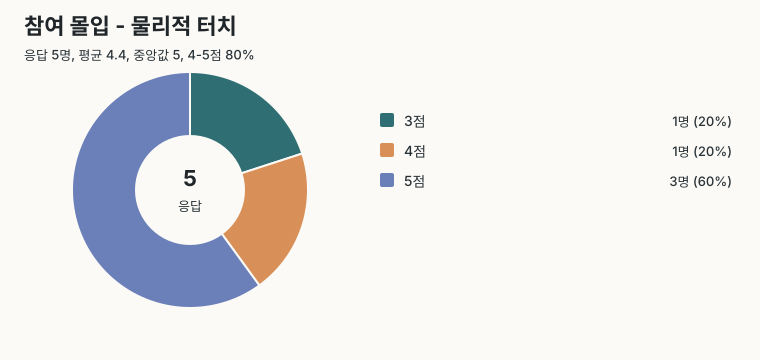

### 상호작용 편안함 - 빔프로젝터

질문: 참여 방식이 직관적이고 부담스럽지 않았다. - 빔프로젝터  
Question: The way of participating felt intuitive and comfortable. - Projection  
답변 방식: 영역별 5점 리커트 척도 단일 선택  
답변 선택지: 1=전혀 그렇지 않다(Strongly disagree), 2=그렇지 않다(Disagree), 3=보통이다(Neutral), 4=그렇다(Agree), 5=매우 그렇다(Strongly agree)  
응답 분포: 1점 0명, 2점 1명, 3점 1명, 4점 0명, 5점 3명

응답 5명, 평균 4, 중앙값 5, 4-5점 60%

### 상호작용 편안함 - 웹 페이지

질문: 참여 방식이 직관적이고 부담스럽지 않았다. - 웹 페이지  
Question: The way of participating felt intuitive and comfortable. - Web page  
답변 방식: 영역별 5점 리커트 척도 단일 선택  
답변 선택지: 1=전혀 그렇지 않다(Strongly disagree), 2=그렇지 않다(Disagree), 3=보통이다(Neutral), 4=그렇다(Agree), 5=매우 그렇다(Strongly agree)  
응답 분포: 1점 0명, 2점 0명, 3점 0명, 4점 2명, 5점 3명

응답 5명, 평균 4.6, 중앙값 5, 4-5점 100%

### 상호작용 편안함 - 실물 터치

질문: 참여 방식이 직관적이고 부담스럽지 않았다. - 실물 터치  
Question: The way of participating felt intuitive and comfortable. - Physical touch  
답변 방식: 영역별 5점 리커트 척도 단일 선택  
답변 선택지: 1=전혀 그렇지 않다(Strongly disagree), 2=그렇지 않다(Disagree), 3=보통이다(Neutral), 4=그렇다(Agree), 5=매우 그렇다(Strongly agree)  
응답 분포: 1점 0명, 2점 0명, 3점 0명, 4점 1명, 5점 4명

응답 5명, 평균 4.8, 중앙값 5, 4-5점 100%

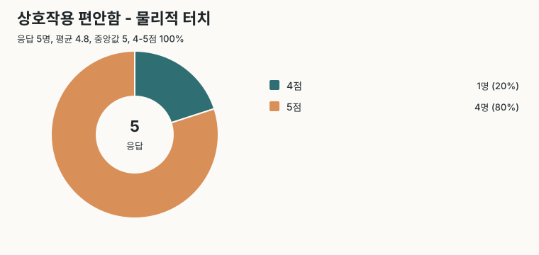

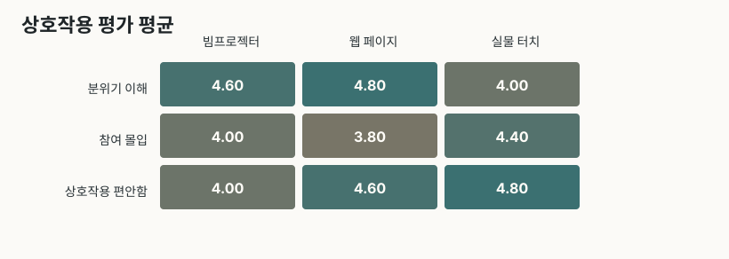

## 인상 깊었던 요소

질문: 이번 공연에서 가장 인상 깊었던 요소는 무엇인가요? 복수 선택이 가능합니다.  
Question: What were the most memorable elements of this performance? You may select multiple options.  
답변 방식: 복수 선택형 체크박스

복수 선택 문항이라 각 선택지 비율의 합이 100%가 아닐 수 있습니다.

| 요소 | Answer | 선택 수 | 응답자 대비 % |
| --- | --- | --- | --- |
| 음악 | Music | 3 | 60 |
| 공간 연출 | Spatial direction | 1 | 20 |
| 천장 프로젝션 | Ceiling projection | 4 | 80 |
| 웹 이모지 반응 | Web emoji reactions | 0 | 0 |
| 천둥 버튼 | Thunder button | 3 | 60 |
| 손 모양 마네킹 인터렉션 | Hand mannequin interaction | 1 | 20 |
| 관객들과 함께 참여하는 분위기 | The shared audience atmosphere | 2 | 40 |

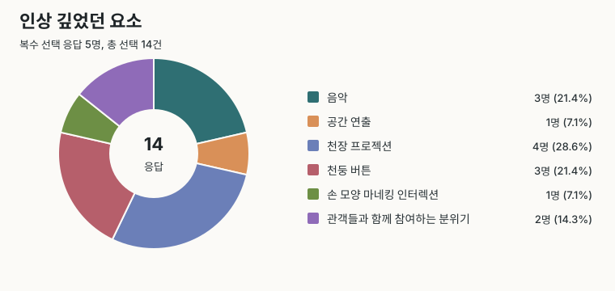

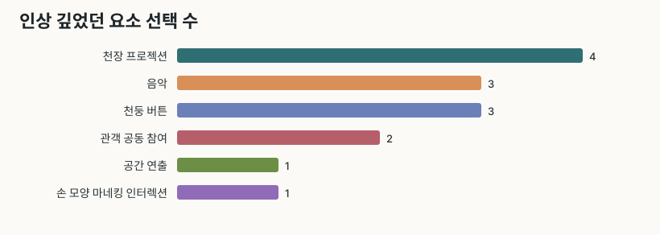

## 서술형 응답

| 문항 | 응답 수 | 응답률 % | 평균 글자 수 | 최소 | 최대 |
| --- | --- | --- | --- | --- | --- |
| 기억에 남는 순간 | 4 | 80 | 81 | 32 | 138 |
| 개선점 | 3 | 60 | 168.7 | 16 | 262 |

### 기억에 남는 순간

질문: 가장 기억에 남은 순간이나 인터렉션을 적어주세요.  
Question: Please write the moment or interaction you remember most.  
답변 방식: 자유 서술형

1. the hand /guitar/ drumsticks were very fun and interactive while actively adding to the musical experience. thr thunder was also memorable

2. 루프? 활용해서 반복 돌렸던 노래가 인상깊어요 + 드럼스틱

3. 관객들이 밴드의 일원으로 참여하는 ‘누군가의‘ 인터렉션이 가장 좋았다.

4. 기타, 드럼, 손 등 다양한 악기와 함께 음악에 참여할 수 있던 인터렉션이 무척 재밌었습니다. 그리고 인상적이었던 것은 천둥인것 같아요. 곡과 프로젝션의 분위기와 무척 잘 어울리는 청각요소였다고 생각합니다.

### 개선점

질문: 개선되었으면 하는 점이 있다면 적어주세요.  
Question: Please share anything you think could be improved.  
답변 방식: 자유 서술형

1. I think that the projection interactions were not adding to the music, my focus was split between seeing if my action affected the screen and the music itself. the projection where my focus was not split was the rain one but otherwise it was a little distracting

2. 방석이 있으면 좋을 거 같아요

3. 아무래도 장비가 아쉽긴 합니다. 카메라 인식 기능이 좋아져서 인터렉션이 더 자연스러웠으면 좋을 것 같아요. 그리고 QR을 통해 모바일적 요소로 인터렉션을 의도한 것은 무척 좋은데, 관람객들이 이모지 등을 통해 감정을 표현할 수 있는 만큼 뭔가 무대에 이모지가 뿅뿅 올라오는(집계되는)  장면을 실시간으로 보여줘도 좋을 것 같습니다. 가사도 볼 수 있고, 곡 내용도 큰 화면으로 볼 수 있으면 좋을 것 같아요.

## 곡별 리액션

| 순서 | 곡 | 총 리액션 | 참여 클라이언트 | 1인당 리액션 | 박수 | 좋아요 | 반짝임 | 파도 |
| --- | --- | --- | --- | --- | --- | --- | --- | --- |
| 1 | 스물여덟 | 4 | 2 | 2 | 3 | 0 | 1 | 0 |
| 2 | 대동제 | 11 | 3 | 3.67 | 3 | 5 | 0 | 3 |
| 3 | 부둣가 | 16 | 4 | 4 | 5 | 5 | 1 | 5 |
| 4 | 소년과 소녀 | 10 | 4 | 2.5 | 1 | 5 | 4 | 0 |
| 5 | 괜한 말 | 5 | 3 | 1.67 | 3 | 0 | 1 | 1 |
| 6 | Knock Knock | 15 | 5 | 3 | 5 | 4 | 5 | 1 |
| 7 | 바다 | 9 | 2 | 4.5 | 2 | 3 | 1 | 3 |
| 8 | Psyche | 0 | 0 | 0 | 0 | 0 | 0 | 0 |
| 9 | 누군가의 | 5 | 2 | 2.5 | 4 | 1 | 0 | 0 |
| 10 | 홍묘 | 7 | 2 | 3.5 | 0 | 6 | 1 | 0 |
| 11 | 새벽두시 | 10 | 3 | 3.33 | 5 | 4 | 1 | 0 |
| 12 | 날 좀 봐줘요, 좀 봐줘요 | 8 | 2 | 4 | 4 | 4 | 0 | 0 |

리액션 총량 상위 곡은 부둣가(16), Knock Knock(15), 대동제(11), 소년과 소녀(10), 새벽두시(10)입니다.

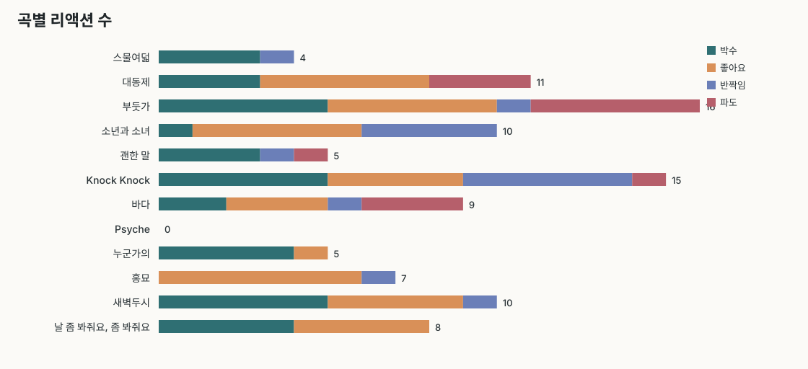

## 리액션 타입별 집계

| 리액션 | 총량 | 참여 클라이언트 | 전체 대비 % |
| --- | --- | --- | --- |
| 좋아요 | 37 | 5 | 37 |
| 박수 | 35 | 6 | 35 |
| 반짝임 | 15 | 5 | 15 |
| 파도 | 13 | 3 | 13 |

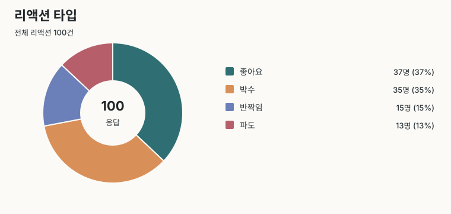

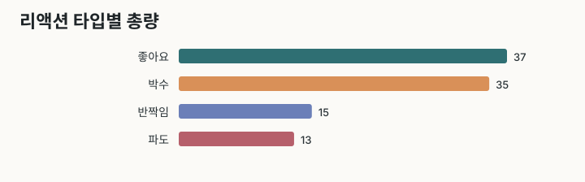

## 원자료 수치표

### 설문 척도 문항

| 문항 | N | 평균 | 중앙값 | Top2(4-5) | 1점 | 2점 | 3점 | 4점 | 5점 |
| --- | --- | --- | --- | --- | --- | --- | --- | --- | --- |
| 전반적 만족도 | 5 | 4 | 4 | 80 | 0 | 0 | 1 | 3 | 1 |
| 흐름/몰입도 | 5 | 4 | 4 | 60 | 0 | 0 | 2 | 1 | 2 |
| 공간 적합도 | 5 | 5 | 5 | 100 | 0 | 0 | 0 | 0 | 5 |
| 바닥 착석 편안함 | 5 | 3.4 | 3 | 40 | 0 | 1 | 2 | 1 | 1 |
| 능동적 참여도 | 5 | 4.4 | 5 | 80 | 0 | 0 | 1 | 1 | 3 |
| 예술적 적합도 | 5 | 3.8 | 4 | 60 | 0 | 1 | 1 | 1 | 2 |
| 재관람 의향 | 5 | 4.2 | 4 | 80 | 0 | 0 | 1 | 2 | 2 |

### 상호작용 평가

| 차원 | 채널 | N | 평균 | 중앙값 | Top2(4-5) | 1점 | 2점 | 3점 | 4점 | 5점 |
| --- | --- | --- | --- | --- | --- | --- | --- | --- | --- | --- |
| 분위기 이해 | 빔프로젝터 | 5 | 4.6 | 5 | 100 | 0 | 0 | 0 | 2 | 3 |
| 분위기 이해 | 웹 페이지 | 5 | 4.8 | 5 | 100 | 0 | 0 | 0 | 1 | 4 |
| 분위기 이해 | 실물 터치 | 5 | 4 | 4 | 80 | 0 | 1 | 0 | 2 | 2 |
| 참여 몰입 | 빔프로젝터 | 5 | 4 | 4 | 60 | 0 | 0 | 2 | 1 | 2 |
| 참여 몰입 | 웹 페이지 | 5 | 3.8 | 4 | 60 | 0 | 1 | 1 | 1 | 2 |
| 참여 몰입 | 실물 터치 | 5 | 4.4 | 5 | 80 | 0 | 0 | 1 | 1 | 3 |
| 상호작용 편안함 | 빔프로젝터 | 5 | 4 | 5 | 60 | 0 | 1 | 1 | 0 | 3 |
| 상호작용 편안함 | 웹 페이지 | 5 | 4.6 | 5 | 100 | 0 | 0 | 0 | 2 | 3 |
| 상호작용 편안함 | 실물 터치 | 5 | 4.8 | 5 | 100 | 0 | 0 | 0 | 1 | 4 |

## 산출 파일

- survey_ratings_summary.csv
- interaction_ratings_summary.csv
- question_overview.csv
- most_impressive_counts.csv
- most_impressive_options_summary.csv
- open_text_summary.csv
- song_reactions_by_song.csv
- song_reactions_by_type.csv
- song_reactions_by_song_type.csv
- joined_client_summary.csv
- reaction_only_clients_summary.csv
- engagement_rating_correlations.csv
- charts/*.svg
